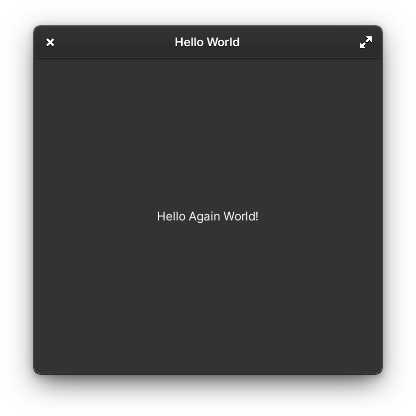

# Color Scheme

elementary OS ships with two styles for app widgets: a dark style and a light style. By default, your app will use the light style, but by using `Gtk.Settings` and `Granite.Settings` you can choose to always use a dark style or to follow the user's preference.

## Setting a Dark Style



Some apps, like photo or video editors, benefit from reducing the contrast between their content and the app's UI by always choosing to be displayed using a dark style. You can set the dark style for your app by using `Gtk.Settings` and setting the property `gtk_application_prefer_dark_theme`. In your Application class, add the following lines to your `activate` function:

```csharp
protected override void activate () {
    var gtk_settings = Gtk.Settings.get_default ();
    gtk_settings.gtk_application_prefer_dark_theme = true;
}
```

Here, we get the default `Gtk.Settings` object and then we set this property to instruct GTK to use the dark style. Build your app and run it and notice that it now uses a dark style instead of a light style.

## Using The User's Preference

Many apps will be usable in either a light or dark style. In this case, apps should respect the user's style preference and adapt when it is changed.

First, make sure you've included Granite in the build dependencies declared in your meson.build file:

```text
executable(
    meson.project_name(),
    'src/Application.vala',
    dependencies: [
        dependency('granite'),
        dependency('gtk+-3.0')
    ],
    install: true
)
```

Also, you need to update the `finish-args` section of your app's Flatpak manifest file with permission to read the user's style preference from AccountsService:

```yaml
finish-args:
  - '--share=ipc'
  - '--socket=fallback-x11'
  - '--socket=wayland'

  # Needed to read prefer-color-scheme with Granite.Settings
  - '--system-talk-name=org.freedesktop.Accounts'
```

Now, you can read and respond to the user's style preference with `Granite.Settings` and then use `Gtk.Settings` to set it in your app's `activate` function.

```csharp
protected override void activate () {
    // First we get the default instances for Granite.Settings and Gtk.Settings
    var granite_settings = Granite.Settings.get_default ();
    var gtk_settings = Gtk.Settings.get_default ();

    // Then, we check if the user's preference is for the dark style and set it if it is
    gtk_settings.gtk_application_prefer_dark_theme = granite_settings.prefers_color_scheme == Granite.Settings.ColorScheme.DARK;

    // Finally, we listen to changes in Granite.Settings and update our app if the user changes their preference
    granite_settings.notify["prefers-color-scheme"].connect (() => {
        gtk_settings.gtk_application_prefer_dark_theme = granite_settings.prefers_color_scheme == Granite.Settings.ColorScheme.DARK;
    });
}
```

