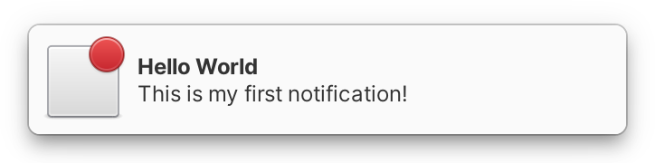

# Notifications



By now you've probably already seen the notification bubbles that appear on the top right of the screen. Notifications are a way to update someone about the state of your app. For example, they can inform the user that a long running background process has been completed or a new message has arrived. In this section we are going to show you just how to get them to work in your app. Let's begin by making a new project!

### Making Preparations

1. Create a new folder inside of "~/Projects" called "notifications-app"
2. Create a new folder inside of that folder called "src" and add a file inside of it called `Application.vala`
3. Create a `meson.build` file. If you don't remember how to set up Meson, go back to the [previous section](../writing-apps/our-first-app/the-build-system.md) and review.
4. Remember how to [make a .desktop file](../writing-apps/our-first-app/#the-desktop-file)? Excellent! Make one for this project, but this time, since your app will be displaying notifications, add `X-GNOME-UsesNotifications=true` to the end of the file. This is needed so that users will be able to set notification preferences for your app in the system's notification settings.

When using notifications, it's important that your desktop file has the same name as your application's ID. This is because elementary OS uses desktop files to find extra information about the app who sends the notification such as a default icon, or the name of the app. To keep things simple, we'll be using the same RDNN everywhere.


If you don't have a desktop file whose name matches the application id, your notification might not be displayed.


### Yet Another Application

In order to display notifications, you're going to need another `Gtk.Application` with a `Gtk.ApplicationWindow`. Remember what we learned in the last few sections and set up a new `Gtk.Application`!

Now that we have an empty window, let's use what we learned in [creating layouts](../writing-apps/creating-layouts.md) and make a grid containing one button that will show a notification.

In between `var main_window...` and `main_window.show ();`, write the following lines of code:

```vala
var title_label = new Gtk.Label (_("Notifications"));
var show_button = new Gtk.Button.with_label (_("Show"));

var grid = new Gtk.Grid ();
grid.orientation = Gtk.Orientation.VERTICAL;
grid.row_spacing = 6;
grid.add (title_label);
grid.add (show_button);

main_window.add (grid);
main_window.show_all ();
```

Since we're adding translatable strings, don't forget to update your translation template by running `ninja com.github.yourusername.yourrepositoryname-pot`.

## Sending Notifications

Now that we have a Gtk.Application we can send notifications. Let's connect a function to the button we created and use it to send a notification:

```vala
show_button.clicked.connect (() => {
    var notification = new Notification (_("Hello World"));
    notification.set_body (_("This is my first notification!"));

    send_notification ("com.github.yourusername.yourrepositoryname", notification);
});
```

Okay, now compile your new app. if everything works, you should see your new app. Click the "Send" button. Did you see the notification? Great! Don't forget to commit and push your project in order to save your branch for later.

## Badge Icons


Notifications will automatically contain your app's icon, but you can add additional context by setting a badge icon. Right after the line containing `var notification = New Notification`, add:

```vala
notification.set_icon (new ThemedIcon ("process-completed"));
```


**Badge icons are new as of elementary OS 6.** In previous versions of elementary OS, your app's icon will be replaced with the set icon.


Compile your app again, and press the "Send" button. As you can see, the notification now has a smaller badged icon placed over your app's icon. Using this method, you can set the icon to any of the named icons shipped with elementary OS.


You can browse the full set of named icons using the app [LookBook](http://appcenter.elementary.io/com.github.danrabbit.lookbook/), available in AppCenter.


## Buttons


You can also add buttons to notifications that will trigger actions defined in the `app` namespace. To add a button, first define an action in your Application class as we did in [the actions section](actions.md).

```vala
var quit_action = new SimpleAction ("quit", null);

add_action (quit_action);

quit_action.activate.connect (() => {
    main_window.destroy ();
});
```

Now, we can add a button to the notification with a translatable label and the action ID.

```vala
notification.add_button (_("Quit"), "app.quit");
```

Compile your app again, and press the "Send" button. Notice that the notification now has a button with the label "Quit" and clicking it will close your app.


Remember that `SimpleAction`s added in the `Application` class with `add_action ()` are automatically added in the `app` namespace. Notifications can't trigger actions defined in other namespaces like `win`.


## Priority

Notifications also have priority. When a notification is set as `URGENT` it will stay on the screen until either the user interacts with it, or you withdraw it. To make an urgent notification, add the following line before the `send_notification ()` function

```vala
notification.set_priority (NotificationPriority.URGENT);
```

`URGENT` notifications should really only be used on the most extreme cases. There are also [other notification priorities](https://valadoc.org/gio-2.0/GLib.NotificationPriority).

## Replace

We now know how to send a notification, but what if you need to update it with new information? Thanks to the notification ID, we can replace a notification with a matching ID. This ID can be anything, but for the purposes of this demo, we're using our app ID.

Let's make the replace button. This button will replace the current notification with one with different information. Let's create a new button for it, and add it to the grid:

```vala
var replace_button = new Gtk.Button.with_label (_("Replace"));

grid.add (replace_button);

replace_button.clicked.connect (() => {
    var notification = new Notification (_("Hello Again"));
    notification.set_body (_("This is my second Notification!"));

    send_notification ("com.github.yourusername.yourrepositoryname", notification);
});
```

Compile and run your app again. Click on the buttons, first on "Show", then "Replace". See how the text on your notification changes without making a new one appear?


You can replace the contents of specific types of notifications your app sends by assigning them a unique ID per category. For example, you can replace the contents of an urgent notification with the ID `alert`, without replacing the contents of a regular notification with a different ID `update`


## Review

Let's review what all we've learned:

* We built an app that sends and updates notifications.
* Notifications automatically get our app's icon, but we can also add a badge icon
* We can add buttons that trigger actions in the `app` namespace
* Notification can have a priority which affects their behavior
* We can replace outdated notifications by setting a replaces ID

As you can see, notifications have a number of advanced features and can automatically inherit some information from `Gtk.Application`. If you need some further reading on notifications, Check out the page about `Glib.Notification` on [Valadoc](https://valadoc.org/gio-2.0/GLib.Notification).
