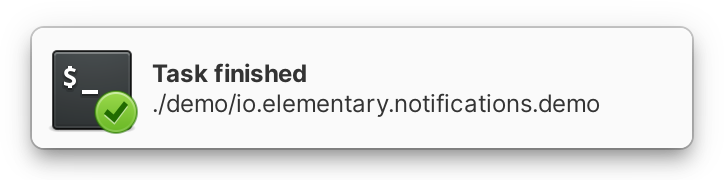
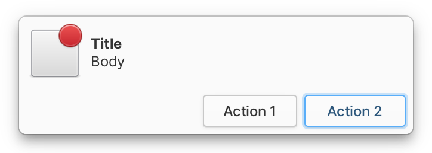

# Notifications

.png>)

By now you've probably already seen the notification bubbles that appear on the top right of the screen. Notifications are a way to provide updates about the state of your app. For example, they can inform you that a long running background process has been completed or a new message has arrived. In this section we are going to show you just how to get them to work in your app.

#### Making Preparations

Create a new `Gtk.Application` complete with a desktop launcher file, packaging, etc. You can review this in [Our First App](../writing-apps/our-first-app/).

In your `.desktop` file, add the line `X-GNOME-UsesNotifications=true` to the end of the file. This is what will make your app appear in System Settings so that notification preferences can be set.


```ini
[Desktop Entry]
Version=1.0
Type=Application

[...]

X-GNOME-UsesNotifications=true
```


## Sending Notifications

In your `Application.vala` file, in the `activate ()` function, create a new [`Gtk.Button`](https://valadoc.org/gtk4/Gtk.Button.html) and add it to a [`Gtk.Box`](https://valadoc.org/gtk4/Gtk.Box.html) with some margins. Then set that box as the child widget for your app's main window.

<figure><figcaption></figcaption></figure>

Finally, connect to the [`clicked ()`](https://valadoc.org/gtk4/Gtk.Button.clicked.html) signal of that button, and create a new `Notification` with body text, and then send it with [`send_notification ()`](https://valadoc.org/gio-2.0/GLib.Application.send\_notification.html).


```vala
protected override void activate () {
    var notify_button = new Gtk.Button.with_label ("Notify");

    var box = new Gtk.Box (Gtk.Orientation.VERTICAL, 12) {
        margin_top = 12,
        margin_end = 12,
        margin_bottom = 12,
        margin_start = 12
    };
    box.append (notify_button);

    var headerbar = new Gtk.HeaderBar () {
        show_title_buttons = true
    };

    var main_window = new Gtk.ApplicationWindow (this) {
        child = box,
        title = "MyApp",
        titlebar = headerbar
    };
    main_window.present ();
    
    notify_button.clicked.connect (() => {
        var notification = new Notification ("Hello World");
        notification.set_body ("This is my first notification!");

        send_notification (null, notification);
    });
}
```


Now build and run your app, and click the "Notify" button. Congratulations, you've learned how to send notifications!

## Badge Icons



Notifications will automatically contain your app's icon, but you can add additional context by setting a badge icon. Right after the line containing `var notification = New Notification`, add:

```vala
notify_button.clicked.connect (() => {
    var notification = new Notification ("Hello World");
    notification.set_body ("This is my first notification!");
    notification.set_icon (new ThemedIcon ("process-completed"));

    send_notification (null, notification);
});
```

Build and run your app again, and press the "Notify" button. As you can see, the notification now has a smaller badged icon placed over your app's icon. Using this method, you can set the icon to any of the named icons shipped with elementary OS.


You can browse the full set of named icons using the [Icon Browser](https://appcenter.elementary.io/io.elementary.iconbrowser/) app, available in AppCenter.


## Buttons



You can also add buttons to notifications that will trigger actions defined in the `app` namespace. To add a button, first define an action in your Application class as we did in [the actions section](actions.md).


```vala
public override void startup () {
    base.startup ();

    var quit_action = new SimpleAction ("quit", null);

    add_action (quit_action);
    quit_action.activate.connect (quit);
}
```


Now, we can add a button to the notification with a label and the action ID.

```vala
notify_button.clicked.connect (() => {
    var notification = new Notification ("Hello World");
    notification.set_body ("This is my first notification!");
    notification.add_button ("Quit", "app.quit");

    send_notification (null, notification);
});
```

Build and run your app again, and press the "Notify" button. Notice that the notification now has a button with the label "Quit" and clicking it will close your app.


Remember that `SimpleAction`s added in the `Application` class with `add_action ()` are automatically added in the `app` namespace. Notifications can't trigger actions defined in other namespaces like `win`.


## Default Action

You may have noticed that when you click on a new notification, a new window pops up. This is happening because the notification has a default action that is executed when the user clicks on it. If you don't set it, it will `activate` your application, where we create a new window and present it.

You can change the default action using  [`set_default_action ()`](https://valadoc.org/gio-2.0/GLib.Notification.set\_default\_action.html)

```vala
notify_button.clicked.connect (() => {
    var notification = new Notification ("Hello World");
    notification.set_body ("This is my first notification!");
    notification.set_default_action ("app.quit");

    send_notification (null, notification);
});
```

If you want to avoid creating a new window every time your application is activated, you need to check if there is a window in [`Gtk.Application.active_window`](https://valadoc.org/gtk4/Gtk.Application.active\_window.html) and present it instead.



```vala
protected override void activate () {
    if (active_window != null) {
        active_window.present ();
        return;
    }

    var notify_button = new Gtk.Button.with_label ("Notify");

    var box = new Gtk.Box (Gtk.Orientation.VERTICAL, 12) {
        margin_top = 12,
        margin_end = 12,
        margin_bottom = 12,
        margin_start = 12
    };
    box.append (notify_button);

    var headerbar = new Gtk.HeaderBar () {
        show_title_buttons = true
    };

    main_window = new Gtk.ApplicationWindow (this) {
        child = box,
        title = "MyApp",
        titlebar = headerbar
    };
    
    notify_button.clicked.connect (() => {
        var notification = new Notification ("Hello World");
        notification.set_body ("This is my first notification!");

        send_notification (null, notification);
    });

    main_window.present ();
}
```


## Priority

Notifications also have priority. When a notification is set as `URGENT` it will stay on the screen until either you interact with it, or your application withdraws it. To make an urgent notification, use the [`set_priority ()`](https://valadoc.org/gio-2.0/GLib.Notification.set\_priority.html) function

```vala
notify_button.clicked.connect (() => {
    var notification = new Notification ("Hello World");
    notification.set_body ("This is my first notification!");
    notification.set_priority (NotificationPriority.URGENT);

    send_notification (null, notification);
});
```

`URGENT` notifications should really only be used on the most extreme cases. There are also [other notification priorities](https://valadoc.org/gio-2.0/GLib.NotificationPriority).

## Replace

We now know how to send a notification, but what if you need to update it with new information? Thanks to the `id` argument of the [`send_notification ()`](https://valadoc.org/gio-2.0/GLib.Application.send\_notification.html) function, we can replace a notification with a matching ID. This ID can be anything you like.

<figure><figcaption></figcaption></figure>

Make a new button with the label "Replace" that sends a new notification, this time with an ID. This button will replace a notification with a matching ID when clicked, instead of sending a new notification.

```vala
protected override void activate () {
    var notify_button = new Gtk.Button.with_label ("Notify");

    var replace_button = new Gtk.Button.with_label ("Replace");

    var box = new Gtk.Box (Gtk.Orientation.VERTICAL, 12) {
        margin_top = 12,
        margin_end = 12,
        margin_bottom = 12,
        margin_start = 12
    };
    box.append (notify_button);
    box.append (replace_button);

    [...]

    replace_button.clicked.connect (() => {
        var notification = new Notification ("Hello Again");
        notification.set_body ("This is my second Notification!");

        send_notification ("update", notification);
    });
}
```

Build and run your app again. Click on the buttons, first on "Notify", then "Replace". See how the "Notify" button sends a new notification each time it's clicked, but the "Replace" button replaces the contents of the same notification when it's clicked.

## Review

Let's review what all we've learned:

* We built [an app that sends notifications](notifications.md#sending-notifications).
* Notifications automatically get our app's icon, but we can also [add a badge icon](notifications.md#badge-icons)
* We can [add buttons](notifications.md#buttons) that trigger actions in the `app` namespace
* Notifications can have a [priority](notifications.md#priority) which affects their behavior
* We can [replace outdated notifications](notifications.md#replace) by setting a replaces ID


If you're having trouble, you can view the full example code [here on GitHub.](https://github.com/vala-lang/examples/tree/glib-notification) You can learn more from `GLib.Notification` [reference documentation](https://valadoc.org/gio-2.0/GLib.Notification.html).

